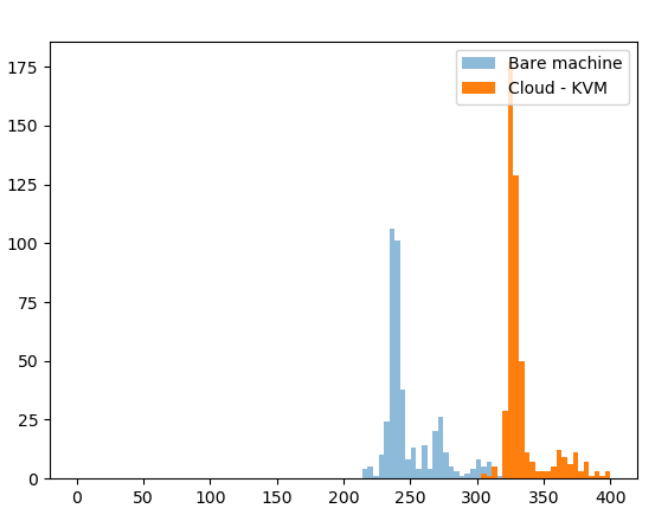

# Detecting Hardware Virtualization with 2 Stage Page-Walk Cost

**Flush & Reload** based technique to detect hardware based virtualization. Steps:

1. Create a target page
2. Fill TLB with random pages
3. Flush(target_page[0])
4. let tlb_cache_miss = Measure Time(target_page[0])
5. Flush(target_page[0])
6. let cache_miss = Measure Time(target_page[0])
7. return tlb_cache_miss - cache_miss

## Results

